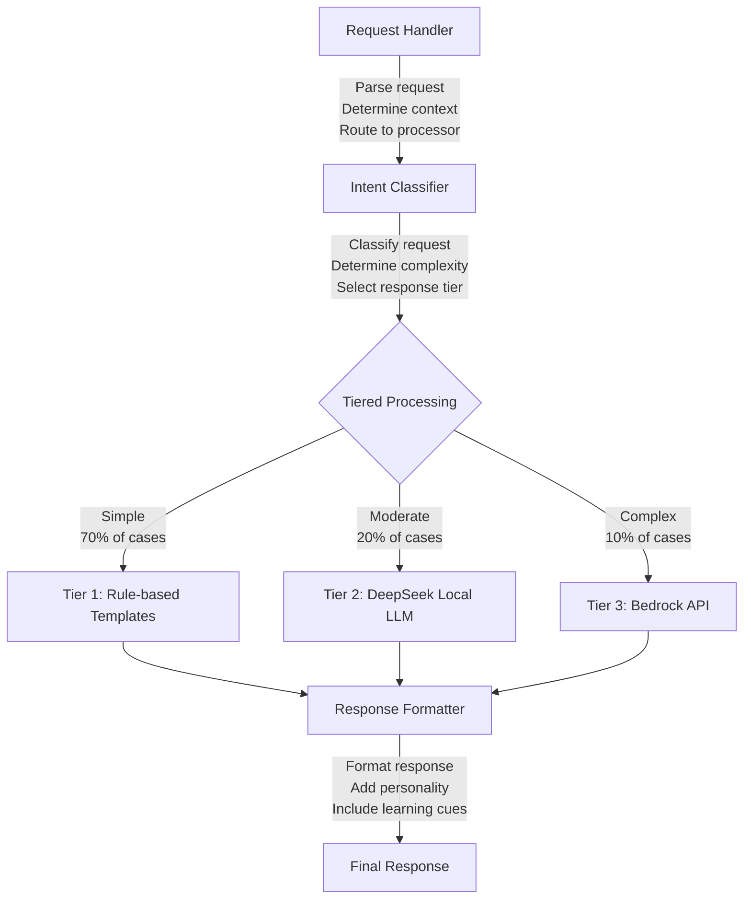
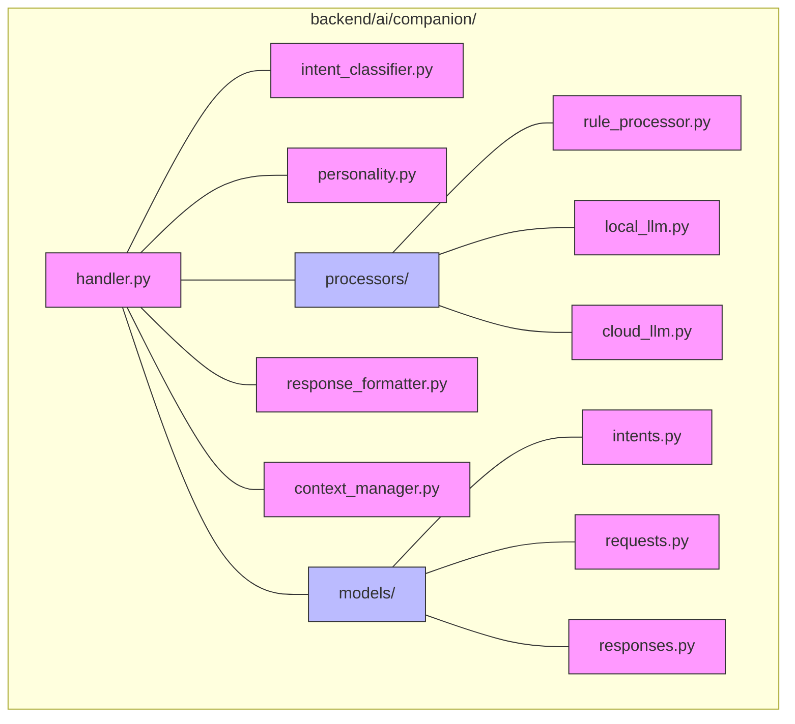
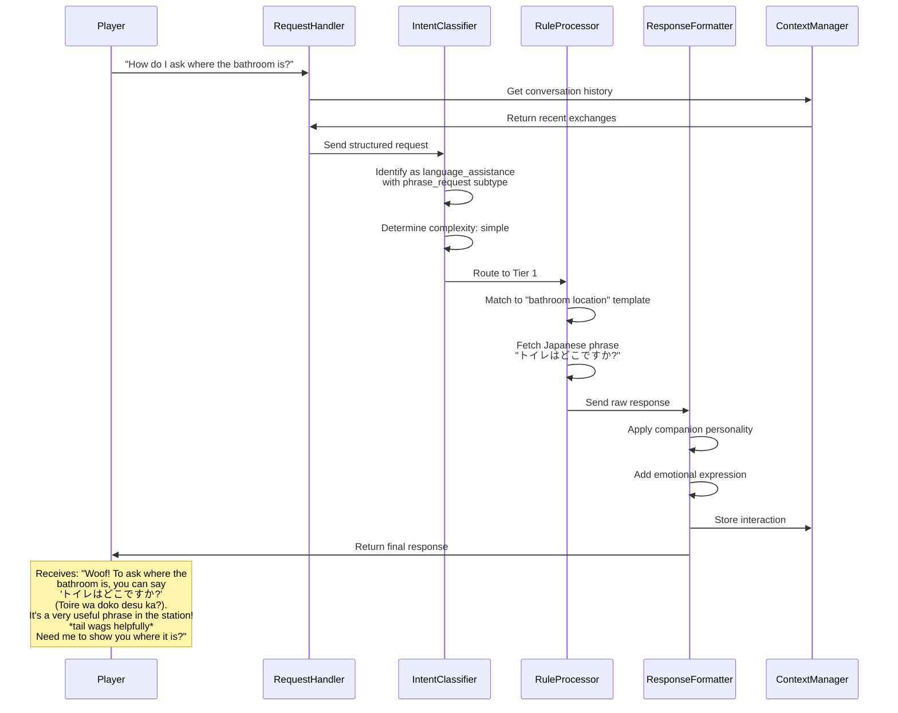
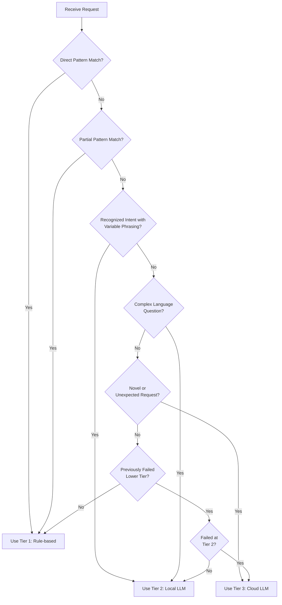
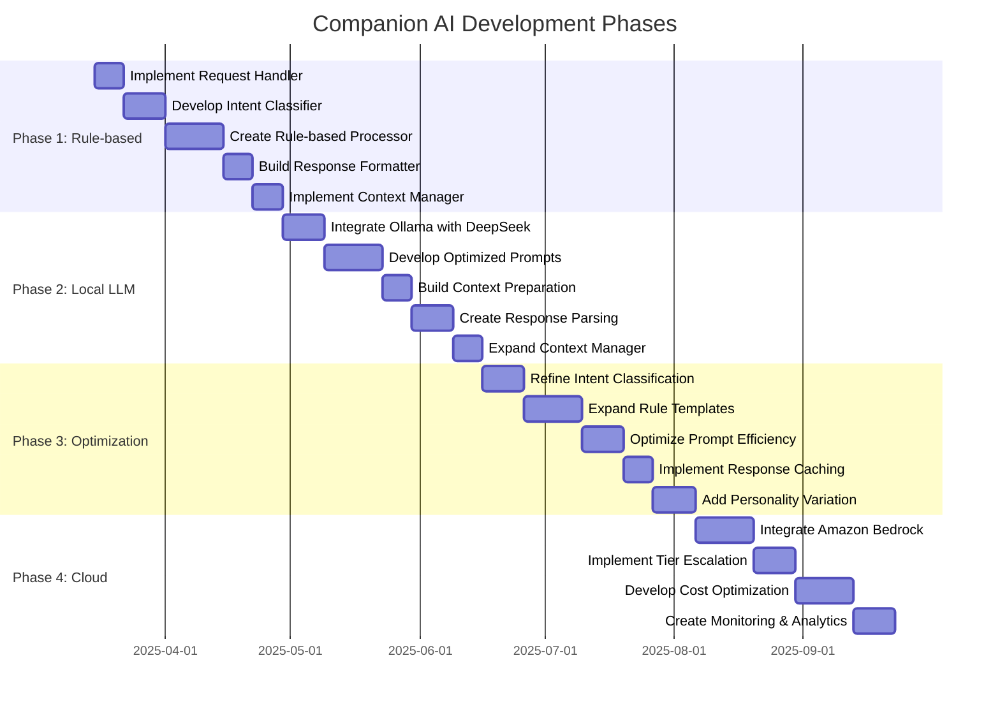

# Tokyo Train Station Adventure
## Companion AI Design Document

This document outlines the architecture and implementation strategy for the companion dog AI component in the Tokyo Train Station Adventure language learning game.

## Overview

The companion dog serves as a bilingual assistant to the player, providing language help, guidance, and encouragement. This component is designed to be tested in isolation before integration with the broader game systems.

## Design Goals

- Create an engaging, personality-driven companion that feels alive
- Optimize for cost efficiency using a tiered processing approach
- Provide helpful but not overwhelming language assistance
- Maintain consistent personality regardless of processing complexity
- Support all companion functions defined in the game design document

## Architecture: Hybrid Approach

The companion AI uses a hybrid approach combining rule-based systems with large language models. This provides precise control over common scenarios while leveraging AI for complex or novel situations.



## Core Components

### 1. Request Handler

**Purpose:** Serves as the entry point for all player interactions with the companion.

**Responsibilities:**
- Parse the player's request and extract relevant parameters
- Maintain session context (conversation history)
- Track the current game context (location, active quest, player progress)
- Route requests to the appropriate component

**Input:** Raw player request, game state context
**Output:** Structured request with extracted parameters

### 2. Intent Classifier

**Purpose:** Determines what the player is asking for and how complex the request is.

**Responsibilities:**
- Analyze player requests using pattern matching and keywords
- Map requests to predefined intent categories
- Determine request complexity based on pattern matching
- Select the appropriate processing tier

**Intent Categories:**
- `vocabulary_help`: Assistance with specific words
- `grammar_explanation`: Explanation of grammar patterns
- `direction_guidance`: Help navigating the station
- `translation_confirmation`: Verification of player's translation
- `general_hint`: Suggestions on what to do next

**Complexity Levels:**
- `simple`: Common requests with clear patterns (→ Tier 1)
- `moderate`: Less common requests with some variation (→ Tier 2)
- `complex`: Novel or highly specific requests (→ Tier 3)

**Input:** Structured request
**Output:** Classified intent with complexity level and tier selection

### 3. Tiered Processing System

The system processes requests using three tiers of increasing complexity and flexibility:

#### Tier 1: Rule-based Processor (70% of interactions)

**Purpose:** Handle common, predictable scenarios with zero API cost.

**Implementation:**
- Template-based responses with variable substitution
- Decision trees for contextual responses
- Pattern matching for player input
- Predefined response sets for each intent category

**Advantages:**
- Immediate response time
- Zero processing cost
- Completely predictable output
- Easy to debug and modify

**Example Scenario:**
```
Intent: vocabulary_help
Context: ticket_machine
Keywords: [切符, ticket]
Response Template: "Woof! '切符' (kippu) means 'ticket' in Japanese. You'll need this word when using the ticket machine or talking to station staff. Want me to show you how to use it in a sentence?"
```

#### Tier 2: Local LLM Processor (20% of interactions)

**Purpose:** Handle moderately complex scenarios with local processing.

**Implementation:**
- Uses Ollama with DeepSeek 7B model
- Carefully crafted prompts that include:
  - Companion personality definition
  - Current conversation context
  - Game state context
  - Language learning level (JLPT N5)
  - Specific instructions for response formatting

**Advantages:**
- More flexible than rule-based responses
- No API costs (using local Ollama)
- Faster than cloud API calls
- Can handle variation in player requests

**Example Prompt Structure:**
```
You are a helpful bilingual dog companion named Hachi in a language learning game.
The player is at JLPT N5 level Japanese.
Current location: Tokyo Station, near the ticket machines.
Recent conversation: [previous 3 exchanges]

The player asks: [player question]

Respond as Hachi with:
1. A brief, friendly greeting (woof!)
2. A helpful explanation appropriate for JLPT N5 level
3. The Japanese phrase or word they need
4. A simple example of usage
5. An encouraging comment
6. Express an emotion through a dog-like action (tail wagging, etc.)

Keep your response under 3 sentences plus the example.
```

#### Tier 3: Cloud LLM Processor (10% of interactions)

**Purpose:** Handle complex or novel scenarios requiring advanced processing.

**Implementation:**
- Uses Amazon Bedrock API (Claude, Llama, etc.)
- Similar prompting strategy to Tier 2 but with more context
- Reserved for situations where local processing is insufficient

**Usage Strategy:**
- Only used when lower tiers cannot produce satisfactory responses
- Responses are cached to prevent repeated API calls
- Implementation planned for later development phases

### 4. Response Formatter

**Purpose:** Ensure consistent personality and quality regardless of processing tier.

**Responsibilities:**
- Format raw responses to maintain consistent style
- Apply companion personality traits
- Add appropriate emotional expressions
- Ensure responses include subtle learning cues
- Adapt response based on player's demonstrated language level

**Processing Steps:**
1. Receive raw response from processing tier
2. Apply personality filters
3. Check for appropriate language level
4. Add emotional expressions if missing
5. Format text with appropriate emphasis and spacing
6. Return finalized response

### 5. Context Manager

**Purpose:** Maintain conversation history and track player learning.

**Responsibilities:**
- Store recent conversation exchanges
- Track what vocabulary/grammar has been discussed
- Record which assistance has been most helpful
- Provide context for subsequent interactions
- Prevent repetitive explanations

**Data Tracked:**
- Last 5-10 conversation turns
- Recently explained vocabulary/grammar points
- Player's successful and unsuccessful interactions
- Frequency of different assistance requests

## Companion Personality Definition

The companion dog (Hachi) has the following key traits:

- **Patient Teacher**: Explains concepts clearly without frustration
- **Enthusiastic Cheerleader**: Celebrates player successes
- **Playful Guide**: Uses dog-like behaviors to make learning fun
- **Knowledgeable Friend**: Expert in Japanese but relates to learning challenges
- **Emotional Communicator**: Expresses emotions through dog behaviors (tail wagging, ears perking, etc.)

**Speech Pattern Elements:**
- Starts responses with "Woof!" or similar dog sounds
- Uses simple, encouraging language
- Expresses emotions through dog actions in asterisks (*wags tail excitedly*)
- Occasionally uses Japanese dog sounds (ワン！)
- Balance between teaching and encouraging

## Implementation in Monorepo

Component location within the project structure:



## Data Flow Example



## Tier Selection Logic



The system determines which tier to use based on the following criteria:

1. **Direct Pattern Match**: If the request directly matches a known pattern, use Tier 1
2. **Partial Pattern Match**: If request has significant similarity to known patterns, use Tier 1
3. **Recognized Intent, Variable Phrasing**: If intent is clear but phrasing is unique, use Tier 2
4. **Complex Language Question**: If request involves explaining nuanced language concepts, use Tier 2
5. **Novel or Unexpected Request**: If request doesn't fit known patterns or intents, use Tier 3
6. **Previously Failed Processing**: If lower tiers failed to provide satisfactory response, escalate to higher tier

## Development Approach



### Phase 1: Rule-based Foundation
- Implement basic Request Handler
- Develop Intent Classifier with primary intents
- Create Rule-based Processor for common scenarios
- Build simple Response Formatter
- Implement basic Context Manager

### Phase 2: Local LLM Integration
- Integrate Ollama with DeepSeek 7B
- Develop optimized prompts
- Build context preparation for LLM
- Create response parsing and validation
- Expand Context Manager for LLM interactions

### Phase 3: Polish and Optimization
- Refine intent classification accuracy
- Expand rule-based templates
- Optimize prompt efficiency
- Implement response caching
- Add more personality variation

### Phase 4: Cloud Integration (Future)
- Integrate with Amazon Bedrock
- Implement tier escalation logic
- Develop cost optimization strategies
- Create monitoring and analytics

## Testing Strategy

The companion AI will be tested in isolation through:

1. **Unit Tests**: Test individual components (intent classification, rule processing)
2. **Integration Tests**: Test complete flow from request to response
3. **Scenario Tests**: Test specific game scenarios and companion behaviors
4. **Language Accuracy Tests**: Validate Japanese language guidance
5. **Personality Consistency Tests**: Ensure character remains consistent
6. **Performance Tests**: Measure response time and resource usage
