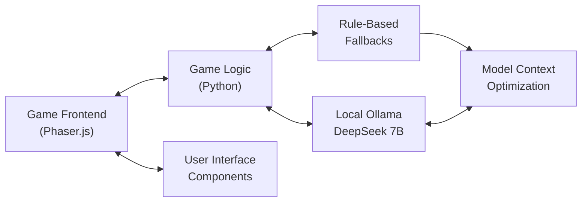
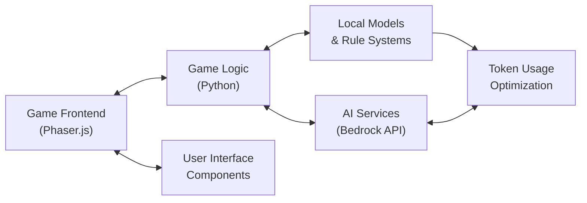
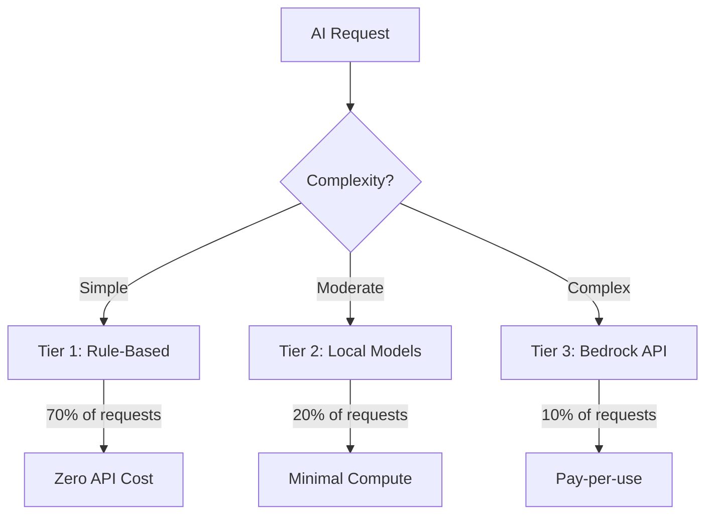
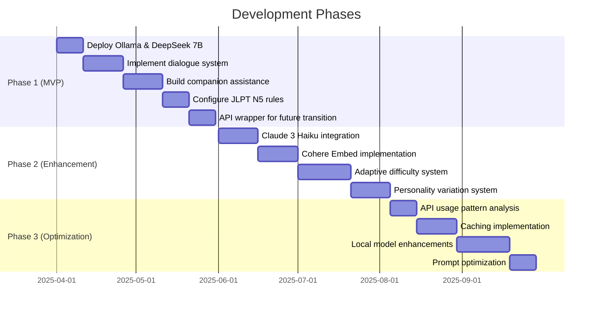

# Tokyo Train Station Adventure
## AI Implementation Plan

This document outlines the proposed AI components for the Tokyo Train Station Adventure language learning game, focusing on cost-effective implementation using free tier models and Amazon Bedrock services.

## Executive Summary

The Tokyo Train Station Adventure game requires several AI components to deliver an engaging and educational Japanese language learning experience. Our implementation strategy prioritizes:

1. MVP development using local Ollama deployment with DeepSeek 7B model
2. Zero API costs during development and initial user testing phases
3. Gradual transition to hybrid model with selective use of Amazon Bedrock services
4. Tiered approach to AI usage based on complexity needs
5. Scalable architecture that can grow with user adoption

## AI Component Breakdown

### 1. Language Processing System

This system handles player's Japanese input and provides appropriate feedback.

| Component | Implementation Approach | Model Selection |
|-----------|------------------------|----------------|
| Input Recognition | Hybrid rule-based + AI approach | Bedrock Claude 3 Haiku for complex inputs |
| Error Tolerance | Pattern matching with semantic similarity | Bedrock Cohere Embed |
| Contextual Understanding | Prompt-based intent recognition | Claude models with context preservation |

**Cost Optimization:**
- Implement local MeCab tokenizer for basic Japanese processing
- Cache common responses for frequently encountered phrases
- Use pre-built JLPT N5 vocabulary validation rules locally

### 2. Companion AI (Dog Assistant)

The bilingual companion serves as both guide and teacher, requiring contextual awareness.

| Component | Implementation Approach | Model Selection |
|-----------|------------------------|----------------|
| Assistance Logic | Template-based with AI augmentation | Bedrock Claude for complex assistance |
| Teaching Behaviors | Rule-based hint progression | Local implementation + AI21 Jurassic-2 |
| Personality Engine | Templated responses with tone variation | Bedrock Meta Llama 2 |

**Cost Optimization:**
- Pre-design common hint sequences for expected learning challenges
- Implement rule-based assistance for predictable scenarios
- Reserve AI calls for novel or complex player interactions

### 3. NPC Interaction System

Creates believable Japanese-speaking NPCs with appropriate responses.

| Component | Implementation Approach | Model Selection |
|-----------|------------------------|----------------|
| Dialogue Management | Structured dialogue trees | Minimal AI usage |
| NPC Reactions | Template-based with limited variability | Claude Instant for unexpected inputs |
| Visual Feedback | Character expression generation | Stable Diffusion XL (limited usage) |

**Cost Optimization:**
- Primarily use pre-written dialogue with branching logic
- Implement fallback responses for off-script interactions
- Use model API calls only for handling truly unexpected inputs

### 4. Progress Tracking System

Monitors and adapts to player learning patterns.

| Component | Implementation Approach | Model Selection |
|-----------|------------------------|----------------|
| Language Proficiency Tracking | Local statistical analysis | No AI required |
| Mistake Pattern Recognition | Simple clustering algorithms | Local implementation |
| Adaptive Difficulty | Rule-based progression system | Periodic analysis with Meta Llama 2 |

**Cost Optimization:**
- Implement fully local tracking for common metrics
- Use batch processing for periodic learning analysis
- Reserve AI for generating personalized learning recommendations

## Technical Implementation Strategy

### MVP Architecture: Local DeepSeek 7B with Ollama

For the MVP phase, we propose leveraging Ollama running DeepSeek 7B locally to significantly reduce costs while validating core functionality. This approach provides several advantages:

- **Zero API costs** during development and initial user testing
- **Full control** over model configuration and fine-tuning
- **Privacy preservation** as all data stays on local development machines
- **Low latency** for faster iteration during development



### Production Architecture (Post-MVP)

As the product matures and user base grows, we'll transition to a hybrid architecture leveraging both local computing and cloud-based AI services:



### Tiered AI Integration



1. **Tier 1: Rule-Based Systems**
   - Implemented locally in Python
   - Handles ~70% of expected interactions
   - Zero ongoing API costs

2. **Tier 2: Lightweight Models**
   - Local embeddings and statistical models
   - Handles ~20% of interactions
   - Minimal memory footprint

3. **Tier 3: Bedrock API Services**
   - Reserved for complex or novel scenarios
   - Handles ~10% of interactions
   - Pay-per-use cost structure

### Development Roadmap



#### Phase 1: Core Functionality (MVP with Ollama + DeepSeek 7B)
- Deploy local Ollama instance with DeepSeek 7B model
- Implement rule-based dialogue system with LLM fallbacks
- Build basic companion assistance using templated responses and local LLM
- Establish local JLPT N5 validation rules
- Optimize prompts for DeepSeek 7B context efficiency
- Create simple API wrapper to make future cloud transition seamless

#### Phase 2: AI Enhancement
- Integrate Claude 3 Haiku for contextual understanding
- Implement Cohere Embed for semantic matching
- Develop adaptive difficulty based on player performance
- Create personality variation in companion responses

#### Phase 3: Refinement and Optimization
- Analyze API usage patterns and optimize high-cost areas
- Implement more sophisticated caching strategies
- Enhance local models based on collected player data
- Fine-tune prompts for maximum efficiency

## Cost Projection

### Cost Comparison

```mermaid
bar
    title Monthly Cost Projection (1,000 Active Users)
    x-axis [$ per month]
    y-axis ["Approach"]
    "MVP with Ollama": 25
    "Hybrid Approach": 150
    "Full Cloud": 325
```

### MVP Phase (Ollama + DeepSeek 7B)
- **Development & Testing**: $0 for AI API costs
- **Initial User Testing (100 users)**: $0 for AI API costs
- **Hardware Requirements**: Moderate GPU for development machines
- **Operational Costs**: Minimal (local server maintenance only)

### Production Phase (Hybrid Approach)

| AI Service | Estimated Usage | Cost Factors | Optimization Strategies |
|------------|----------------|--------------|------------------------|
| Local DeepSeek (via Ollama) | 60-70% of interactions | Server hardware, electricity | Batching requests, optimized inference |
| Claude 3 Haiku | 3-5 calls per play session | Token count, request frequency | Context compression, caching |
| Cohere Embed | 10-15 calls per play session | Embedding dimensions, frequency | Batch processing, local storage |
| AI21 Jurassic-2 | 2-3 calls per play session | Token count | Template hybridization |
| Stable Diffusion XL | Limited to key moments | Generation complexity | Pre-generate common expressions |
