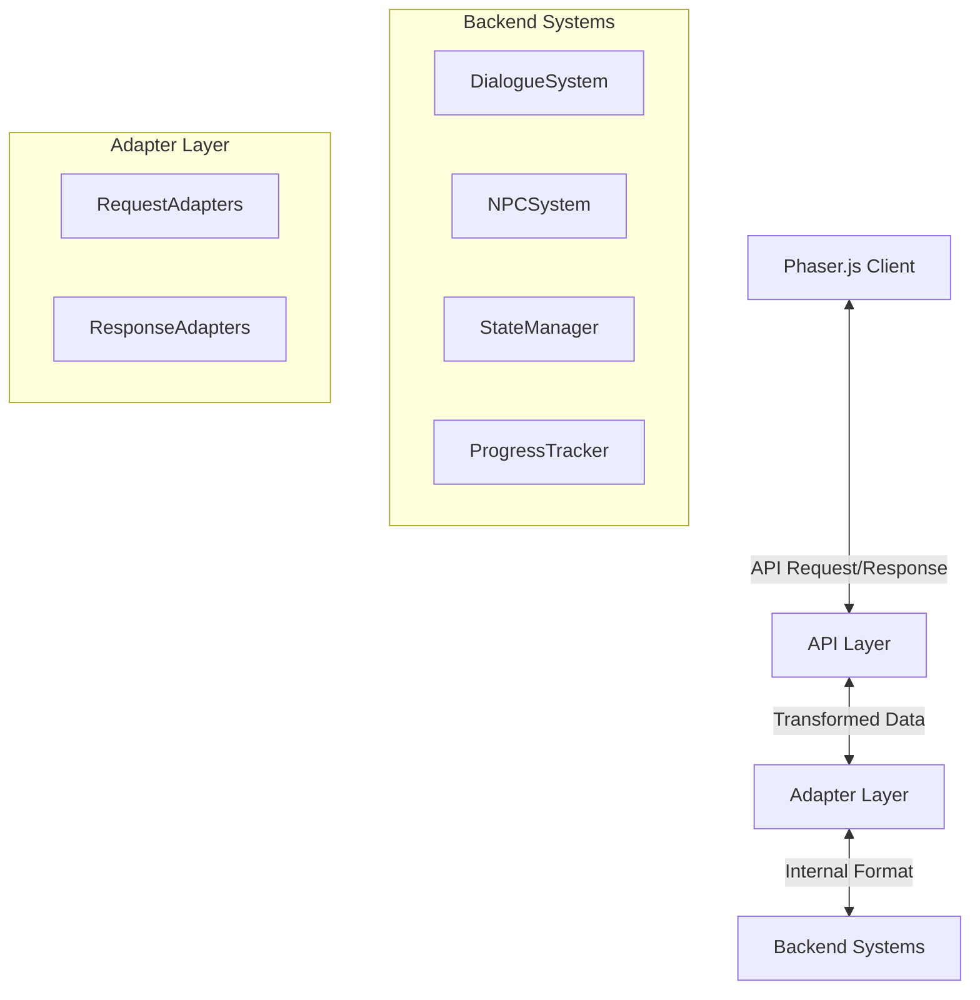

# Adapter Design Pattern in Tokyo Train Station Adventure API

This document explains the adapter pattern implementation used in the Tokyo Train Station Adventure game's API to transform internal data formats into frontend-friendly structures.

## Overview

The Tokyo Train Station Adventure API uses the Adapter pattern to decouple the internal backend representations from the external API responses. This approach allows the backend systems to evolve independently while maintaining a consistent interface for the Phaser.js frontend.



## Purpose and Benefits

The adapter layer serves several critical purposes:

1. **Decoupling**: Isolates changes in internal representations from external API contracts
2. **Transformation**: Converts internal domain objects to frontend-optimized structures
3. **Consistency**: Ensures uniform response formatting across different endpoints
4. **Evolution**: Allows backend refactoring without breaking the client interface
5. **Optimization**: Tailors responses to minimize payload size and improve frontend processing

## Core Components

### Adapter Factory

The `AdapterFactory` provides the appropriate adapter based on the response type:

```python
class AdapterFactory:
    """Factory for creating response adapters"""
    
    @staticmethod
    def get_adapter(response_type):
        """Get the appropriate adapter for the response type"""
        adapters = {
            "companion": CompanionResponseAdapter(),
            "dialogue": DialogueResponseAdapter(),
            "progress": ProgressResponseAdapter(),
            "npc": NPCResponseAdapter(),
            "gameState": GameStateAdapter()
        }
        return adapters.get(response_type, GenericResponseAdapter())
```

### Response Adapters

Each adapter handles a specific type of response:

```python
class ResponseAdapter(ABC):
    """Base class for all response adapters"""
    
    @abstractmethod
    def adapt(self, internal_response):
        """Transform an internal response to the external format"""
        pass
```

Example implementations include:

- `CompanionResponseAdapter`: Transforms companion AI responses
- `DialogueResponseAdapter`: Transforms NPC dialogue responses
- `ProgressResponseAdapter`: Transforms learning progress data
- `NPCResponseAdapter`: Transforms NPC entity data
- `GameStateAdapter`: Transforms game state objects

### Request Adapters

Similarly, request adapters transform client requests into internal formats:

```python
class RequestAdapter:
    """Adapts incoming requests to the expected internal format"""
    
    @staticmethod
    def adapt_companion_request(request_data):
        """Adapts companion assistance request"""
        # Transform external request to internal format
        return internal_request
    
    @staticmethod
    def adapt_dialogue_request(request_data):
        """Adapts dialogue processing request"""
        # Transform external request to internal format
        return internal_request
```

## Implementation Details

### Transformation Logic

Adapters use various transformation strategies:

1. **Field Mapping**: Renaming fields to match client expectations
2. **Data Aggregation**: Combining multiple internal objects into a single response
3. **Format Conversion**: Converting between data types (e.g., enums to strings)
4. **Enrichment**: Adding derived or calculated fields not present in internal models
5. **Filtering**: Removing internal implementation details not relevant to the client

### Example Transformation

#### Internal Response (Backend)

```json
{
  "responseId": "resp-12345",
  "responseText": "Woof! That's the ticket machine.",
  "japanesePhrase": "切符売機",
  "pronunciation": "kippu-uriki",
  "companionAction": "POINT_AT_SCREEN",
  "companionEmotion": "excited",
  "highlightElements": ["ticket_machine"],
  "suggestions": ["How do I buy a ticket?"]
}
```

#### External Response (Client)

```json
{
  "dialogue": {
    "text": "Woof! That's the ticket machine.",
    "japanese": "切符売機",
    "pronunciation": "kippu-uriki",
    "characterName": "Hachi"
  },
  "companion": {
    "animation": "pointing",
    "emotionalState": "excited"
  },
  "ui": {
    "highlights": [
      {
        "id": "ticket_machine",
        "effect": "pulse",
        "duration": 3000
      }
    ],
    "suggestions": [
      {
        "text": "How do I buy a ticket?",
        "action": "ASK_QUESTION"
      }
    ]
  }
}
```

### Adapter Application in API Routes

The adapter pattern is applied in the API route handlers:

```python
@app.post("/api/companion/assist")
async def companion_assist(request: Request):
    # Get request data
    request_data = await request.json()
    
    # Adapt incoming request if needed
    internal_request = RequestAdapter.adapt_companion_request(request_data)
    
    # Process with existing backend logic
    internal_response = companion_service.process_request(internal_request)
    
    # Adapt the response to the external format
    adapter = AdapterFactory.get_adapter("companion")
    external_response = adapter.adapt(internal_response)
    
    return JSONResponse(content=external_response)
```

## Specific Adapter Implementations

### CompanionResponseAdapter

```python
class CompanionResponseAdapter:
    """Transforms internal companion responses to frontend-friendly format"""
    
    @staticmethod
    def adapt(internal_response):
        """Transform companion assistance response"""
        result = {
            "dialogue": {
                "text": internal_response.get("responseText", ""),
                "japanese": internal_response.get("japanesePhrase"),
                "pronunciation": internal_response.get("pronunciation"),
                "characterName": "Hachi"
            },
            "companion": {
                "animation": CompanionResponseAdapter._map_action_to_animation(
                    internal_response.get("companionAction", "")
                ),
                "emotionalState": internal_response.get("companionEmotion", "neutral")
            },
            "ui": {
                "highlights": CompanionResponseAdapter._format_highlights(
                    internal_response.get("highlightElements", [])
                ),
                "suggestions": CompanionResponseAdapter._format_suggestions(
                    internal_response.get("suggestions", [])
                )
            }
        }
        return result
    
    @staticmethod
    def _map_action_to_animation(action_name):
        """Maps internal action names to frontend animation names"""
        action_map = {
            "POINT_AT_SCREEN": "pointing",
            "WAG_TAIL": "tail_wag",
            "SIT": "sitting",
            "TILT_HEAD": "head_tilt"
        }
        return action_map.get(action_name, "idle")
```

### DialogueResponseAdapter

```python
class DialogueResponseAdapter:
    """Transforms internal dialogue responses to frontend-friendly format"""
    
    @staticmethod
    def adapt(internal_response):
        """Transform dialogue processing response"""
        result = {
            "dialogue": {
                "text": internal_response.get("responseText", ""),
                "japanese": internal_response.get("japaneseText"),
                "pronunciation": None,  # Derived field not in internal format
                "characterName": DialogueResponseAdapter._get_character_name(internal_response)
            },
            "feedback": DialogueResponseAdapter._format_feedback(
                internal_response.get("correctness", {})
            ),
            "npc": {
                "id": internal_response.get("npcId"),
                "animation": None,  # Will be populated based on emotional state
                "emotionalState": "neutral"  # Default value
            }
        }
        return result
```

## Handling Special Cases

### Nullable Fields

The adapter handles nullable fields explicitly to ensure the API contract is maintained:

```python
# If the field exists in internal response, use it; otherwise use null/default
result["dialogue"]["japanese"] = internal_response.get("japaneseText", None)
```

### Derived Fields

Some fields in the external API don't directly map to internal fields but are derived:

```python
# Calculate a highlight color based on correctness score
score = correctness.get("score", 1.0)
if score < 0.3:
    highlight_color = "#FF6B6B"  # Red
elif score < 0.7:
    highlight_color = "#FFD166"  # Yellow
else:
    highlight_color = "#06D6A0"  # Green
```

### Default Values

The adapter provides sensible defaults when internal data is missing:

```python
# If emotion is not specified, default to neutral
result["companion"]["emotionalState"] = internal_response.get("companionEmotion", "neutral")
```

## Testing Strategy

The adapter layer is thoroughly tested with:

1. **Unit Tests**: Verify each adapter correctly transforms sample data
2. **Conversion Tests**: Ensure all fields are correctly mapped
3. **Edge Case Tests**: Validate handling of null, missing, or invalid values
4. **Integration Tests**: Confirm adapters work with actual backend responses

Example test:

```python
def test_companion_response_adaptation():
    # Given an internal response format
    internal_response = {
        "responseId": "test-123",
        "responseText": "Woof! That's the ticket machine.",
        "japanesePhrase": "切符売機",
        "pronunciation": "kippu-uriki",
        "companionAction": "POINT_AT_SCREEN"
    }
    
    # When adapting to external format
    result = CompanionResponseAdapter.adapt(internal_response)
    
    # Then verify the transformation
    assert result["dialogue"]["text"] == "Woof! That's the ticket machine."
    assert result["dialogue"]["japanese"] == "切符売機"
    assert result["companion"]["animation"] == "pointing"  # Mapped from POINT_AT_SCREEN
```

## Versioning Strategy

The adapter pattern facilitates API versioning:

1. **Version-Specific Adapters**: Different adapter implementations for different API versions
2. **Gradual Evolution**: New fields can be added without breaking existing clients
3. **Deprecation Path**: Fields can be marked as deprecated before removal

```python
class DialogueResponseAdapterV2(DialogueResponseAdapter):
    """V2 adapter with enhanced fields"""
    
    @staticmethod
    def adapt(internal_response):
        # Get base adaptation
        result = DialogueResponseAdapter.adapt(internal_response)
        
        # Add new V2 fields
        result["contextualHints"] = DialogueResponseAdapterV2._generate_hints(internal_response)
        
        return result
```

## Performance Considerations

To ensure optimal API performance:

1. **Caching**: Frequently used adapter transformations are cached
2. **Lazy Transformation**: Some fields are transformed only when needed
3. **Field Selection**: Only requested fields are transformed when partial responses are supported
4. **Bulk Adaptation**: Batch processing for collections of items

## Conclusion

The adapter design pattern in the Tokyo Train Station Adventure API provides a clean separation between internal backend representations and external client-facing structures. This approach:

- Provides flexibility to evolve the backend independently
- Maintains a consistent API contract for frontend developers
- Optimizes responses for frontend consumption
- Creates a centralized location for response formatting logic
- Facilitates testing and versioning of the API

For specific adapter implementations, refer to the corresponding source files in the backend codebase.
