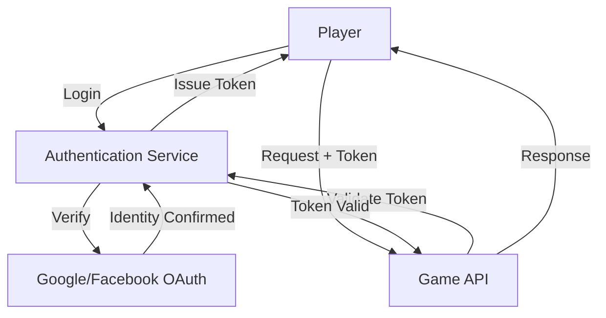

# API Security Considerations

This document outlines the security measures implemented in the Tokyo Train Station Adventure game's REST API to protect user data and ensure secure communication.

## Authentication System

### Overview

The API uses a token-based authentication system with OAuth 2.0 integration for secure identity verification. This provides a flexible and secure approach to managing user sessions while supporting third-party authentication providers.



### Authentication Flow

1. **Initial Authentication**:
   - User logs in via Google or Facebook OAuth (as specified in the Game Design Document)
   - Authentication service verifies identity with the OAuth provider
   - Upon successful verification, a signed JWT session token is issued

2. **Request Authentication**:
   - Each API request includes the session token in the Authorization header
   - API validates the token's signature, expiration, and claims
   - If valid, the request proceeds; otherwise, a 401 Unauthorized response is returned

3. **Token Refresh**:
   - Tokens have a limited lifespan (default: 24 hours)
   - A refresh token mechanism allows extending sessions without re-authentication
   - After a maximum period (default: 30 days), full re-authentication is required

### Implementation Details

```python
# Authentication middleware example
@app.middleware("http")
async def authenticate_requests(request: Request, call_next):
    # Public endpoints that don't require authentication
    public_paths = ["/api/auth/login", "/api/auth/refresh", "/health"]
    
    # Skip authentication for public endpoints
    if any(request.url.path.startswith(path) for path in public_paths):
        return await call_next(request)
    
    # Get the Authorization header
    auth_header = request.headers.get("Authorization")
    if not auth_header or not auth_header.startswith("Bearer "):
        return JSONResponse(
            status_code=401,
            content={
                "error": "Unauthorized",
                "message": "Authentication required to access this endpoint",
                "details": None
            }
        )
    
    # Extract and verify the token
    token = auth_header.split(" ")[1]
    try:
        payload = jwt.decode(
            token,
            settings.JWT_SECRET_KEY,
            algorithms=[settings.JWT_ALGORITHM]
        )
        
        # Add user info to request state
        request.state.user = {
            "id": payload["sub"],
            "roles": payload.get("roles", []),
            "sessionId": payload.get("sid")
        }
    except jwt.ExpiredSignatureError:
        return JSONResponse(
            status_code=401,
            content={
                "error": "Unauthorized",
                "message": "Session has expired",
                "details": {"code": "token_expired"}
            }
        )
    except jwt.InvalidTokenError:
        return JSONResponse(
            status_code=401,
            content={
                "error": "Unauthorized",
                "message": "Invalid authentication token",
                "details": None
            }
        )
    
    # Continue processing the request
    return await call_next(request)
```

## Authorization System

### Role-Based Access Control

The API implements role-based access control (RBAC) to restrict access to certain endpoints:

| Role | Description | Access Level |
|------|-------------|--------------|
| `player` | Standard game player | Basic game functionality |
| `admin` | Game administrator | Administrative functions |
| `developer` | Development team | Debug endpoints and monitoring |

### Permission Checks

```python
# Permission checking decorator example
def require_role(required_role: str):
    def decorator(func):
        @wraps(func)
        async def wrapper(request: Request, *args, **kwargs):
            # Get user from request state (set by authentication middleware)
            user = request.state.user
            
            # Check if user has the required role
            if required_role not in user.get("roles", []):
                return JSONResponse(
                    status_code=403,
                    content={
                        "error": "Forbidden",
                        "message": f"{required_role.title()} role required to access this endpoint",
                        "details": None
                    }
                )
            
            # User has required role, proceed
            return await func(request, *args, **kwargs)
        return wrapper
    return decorator

# Example usage on an endpoint
@app.put("/api/npc/config/{npcId}")
@require_role("admin")
async def update_npc_config(request: Request, npcId: str):
    # Only admins can reach this code
    # ...
```

## Data Protection

### Personal Data Handling

The API follows data protection best practices:

1. **Minimal Collection**: Only essential user data is collected
2. **Data Encryption**: Sensitive data is encrypted at rest
3. **Data Anonymization**: Analytics data is anonymized where possible
4. **Data Deletion**: User data can be fully deleted upon request

### In-Transit Encryption

All API communications occur over HTTPS with:
- TLS 1.3 enforcement
- Strong cipher suites
- Certificate pinning in the client application
- HSTS headers

### Database Security

User data stored in SQLite is protected through:

1. **Encryption**: Database files are encrypted
2. **Access Controls**: Database access is restricted to the application service account
3. **Query Parameterization**: All SQL queries use parameterization to prevent injection attacks
4. **Sensitive Data Handling**: Passwords and tokens are hashed using bcrypt with appropriate work factors

## API Protection Mechanisms

### Rate Limiting

To prevent abuse, the API implements rate limiting:

```python
# Rate limiting middleware example
@app.middleware("http")
async def rate_limit_requests(request: Request, call_next):
    # Skip rate limiting for certain paths
    excluded_paths = ["/health"]
    if any(request.url.path.startswith(path) for path in excluded_paths):
        return await call_next(request)
    
    # Get client identifier (user ID or IP address)
    client_id = request.state.user["id"] if hasattr(request.state, "user") else request.client.host
    
    # Check rate limit
    rate_limit_key = f"rate_limit:{client_id}:{request.url.path}"
    current_count = await redis.get(rate_limit_key)
    
    # Rate limits vary by endpoint
    rate_limit = get_rate_limit_for_endpoint(request.url.path)
    
    if current_count and int(current_count) >= rate_limit.max_requests:
        return JSONResponse(
            status_code=429,
            content={
                "error": "Too Many Requests",
                "message": "Rate limit exceeded",
                "details": {
                    "retryAfter": rate_limit.period_seconds,
                    "limit": f"{rate_limit.max_requests} requests per {rate_limit.period_seconds} seconds"
                }
            },
            headers={"Retry-After": str(rate_limit.period_seconds)}
        )
    
    # Increment counter or set new one
    if current_count:
        await redis.incr(rate_limit_key)
    else:
        await redis.set(rate_limit_key, 1, ex=rate_limit.period_seconds)
    
    # Continue processing the request
    return await call_next(request)
```

Rate limits vary by endpoint type:

| Endpoint Type | Rate Limit |
|---------------|------------|
| Standard game APIs | 120 requests per minute |
| Authentication endpoints | 10 requests per minute |
| Administrative endpoints | 60 requests per minute |

### Input Validation

All API inputs are validated using Pydantic models to ensure:

1. **Type Safety**: All values are of the expected type
2. **Constraints**: Values meet defined constraints (length, range, etc.)
3. **Required Fields**: All required fields are present
4. **Format Validation**: Values match expected formats (e.g., email, UUID)

Example validation model:

```python
class NPCConfigUpdate(BaseModel):
    profile: Optional[NPCProfile] = None
    languageProfile: Optional[LanguageProfile] = None
    promptTemplates: Optional[PromptTemplates] = None
    conversationParameters: Optional[ConversationParameters] = None
    
    class NPCProfile(BaseModel):
        name: Optional[str] = None
        role: Optional[str] = None
        location: Optional[str] = None
        personality: Optional[List[str]] = None
        expertise: Optional[List[str]] = None
        limitations: Optional[List[str]] = None
        
        @validator('name')
        def name_not_empty(cls, v):
            if v is not None and len(v.strip()) == 0:
                raise ValueError('Name cannot be empty')
            return v
```

### Protection Against Common Attacks

The API includes measures to protect against common web application attacks:

1. **SQL Injection**: Using parameterized queries and ORM
2. **Cross-Site Scripting (XSS)**: Content-Security-Policy headers and input sanitization
3. **Cross-Site Request Forgery (CSRF)**: CSRF tokens for sensitive operations
4. **Request Forgery**: Validating Origin and Referer headers
5. **Dependency Attacks**: Regular security updates for all dependencies

## AI-Specific Security Considerations

Given the game's reliance on AI, special security measures are implemented:

1. **Prompt Injection Protection**: All user inputs are sanitized before being sent to AI models
2. **Response Validation**: AI-generated responses are validated before being sent to clients
3. **Content Filtering**: AI responses are checked for inappropriate content
4. **Logging and Monitoring**: AI interactions are logged for anomaly detection

Example prompt safety code:

```python
def sanitize_for_ai_prompt(user_input: str) -> str:
    """Sanitize user input before including in AI prompts."""
    # Remove potential prompt injection patterns
    patterns = [
        r"<|endoftext|>",
        r"<\|.*?\|>",
        r"```.*?```",
        r"<.*?>",  # Remove HTML-like tags
    ]
    
    sanitized = user_input
    for pattern in patterns:
        sanitized = re.sub(pattern, "", sanitized)
    
    # Trim and normalize whitespace
    sanitized = " ".join(sanitized.split())
    
    # Truncate to reasonable length
    max_length = 200  # Adjust based on use case
    if len(sanitized) > max_length:
        sanitized = sanitized[:max_length] + "..."
    
    return sanitized
```

## Security Monitoring and Response

### Logging and Monitoring

Security-related events are logged for monitoring:

1. **Authentication Events**: Login attempts, failures, token revocations
2. **Authorization Events**: Access denials, permission changes
3. **Rate Limiting Events**: Rate limit breaches
4. **Unusual Activity**: Unexpected request patterns, potential attacks

### Incident Response

A defined incident response process includes:

1. **Detection**: Automated alerting for security anomalies
2. **Analysis**: Investigation of potential security events
3. **Containment**: Rapid isolation of affected systems
4. **Eradication**: Removal of security threats
5. **Recovery**: Restoration of normal operations
6. **Post-Incident Review**: Analysis and improvement

## Security Configuration for Different Environments

Security settings are environment-specific:

| Setting | Development | Testing | Production |
|---------|-------------|---------|------------|
| Token Lifespan | 7 days | 24 hours | 24 hours |
| Rate Limits | Disabled | Relaxed | Strict |
| Error Detail | Verbose | Standard | Minimal |
| Logging Level | Debug | Info | Warning |
| Content Security Policy | Permissive | Moderate | Strict |

## Implementation Checklist for Developers

When implementing new API endpoints, developers should ensure:

- [ ] Endpoint is protected by authentication middleware (unless public)
- [ ] Appropriate role-based permissions are applied
- [ ] Input validation uses Pydantic models
- [ ] Rate limiting is configured appropriately
- [ ] SQL queries use parameterization
- [ ] Error responses don't leak sensitive information
- [ ] Logging includes relevant security events
- [ ] AI inputs are sanitized if applicable

## Conclusion

The security measures implemented in the Tokyo Train Station Adventure API provide a robust foundation for protecting user data and ensuring secure gameplay. The combination of OAuth integration, role-based access control, and comprehensive protection mechanisms creates multiple layers of security while maintaining a good user experience.

Regular security reviews and updates will ensure that the API remains protected against evolving threats as the game continues to develop and grow its user base.
