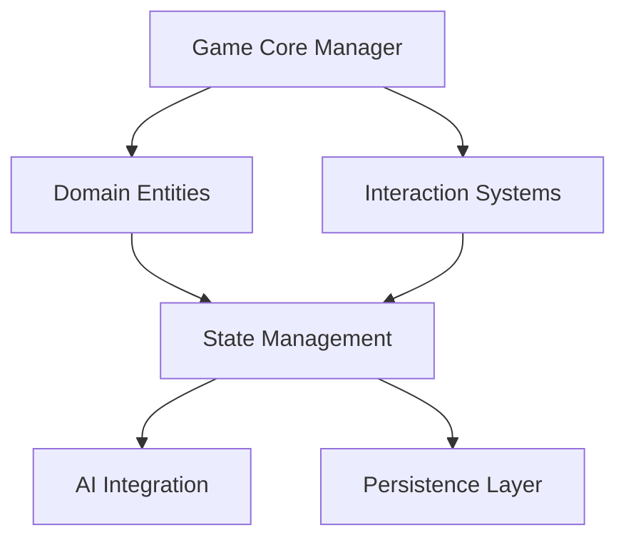
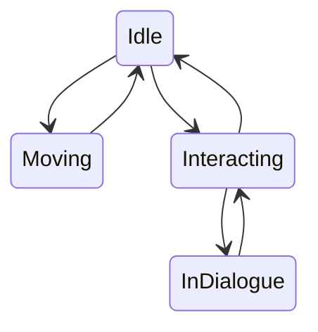
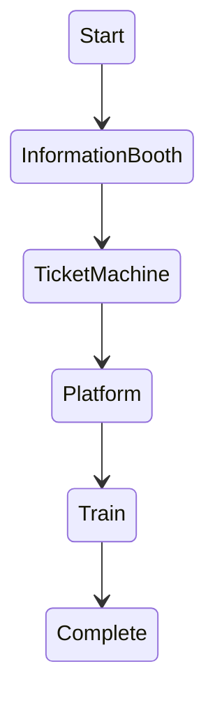
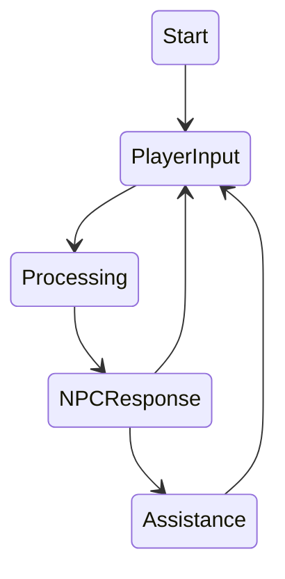

# Tokyo Train Station Adventure
## Python Game Logic Architecture

This document outlines the core game logic architecture for the Tokyo Train Station Adventure language learning game, focusing on the Python backend components that will interface with the Phaser.js frontend.

## Architecture Overview

Our game logic will follow a domain-driven design approach, with clear separation of concerns between game state management, entity behaviors, interaction systems, and language processing components.



## Core Components

### 1. Game Core Manager

The central coordinating module that manages initialization, game loop, and communication between components.

**Requirements:**
- Implement a modular initialization system for all game components
- Provide event management for game-wide events
- Handle API communication with frontend
- Coordinate updates between entities, state, and systems
- Support runtime configuration loading

**Key Classes:**
- `GameManager`: Central coordinator
- `EventBus`: Event pub/sub system
- `ConfigManager`: Configuration management
- `APIHandler`: Frontend communication

### 2. Domain Entity System

Represents all game entities with their attributes and behaviors.

**Requirements:**
- Implement entity base class with common attributes and methods
- Create inheritance hierarchy for specialized entities
- Support component-based behavior extensions
- Implement entity lifecycle management
- Define clear interfaces for entity interactions

**Key Entities:**
- `Entity`: Base class for all game entities
- `Player`: Player character with inventory and language proficiency
- `Companion`: Dog entity with assistance behaviors
- `NPC`: Japanese-speaking characters with interaction patterns
- `EnvironmentObject`: Interactive objects like ticket machines

**Entity Structure Example:**
```python
# Conceptual structure only - not for implementation
class Player(Entity):
    attributes = {
        'position': Vector2D,
        'inventory': Inventory,
        'language_proficiency': LanguageProficiency,
        'quest_progress': QuestTracker
    }
    
    behaviors = {
        'movement': MovementComponent,
        'interaction': InteractionComponent,
        'dialogue': DialogueComponent
    }
```

### 3. Interaction Systems

Manages all interactions between entities, implementing game mechanics and rules.

**Requirements:**
- Create modular interaction handlers for different interaction types
- Implement a dialogue system supporting multiple input methods
- Develop an interaction detection system (proximity, button press)
- Support contextual interactions based on game state
- Provide feedback mechanisms for successful/failed interactions

**Key Systems:**
- `InteractionManager`: Coordinates all interaction systems
- `DialogueSystem`: Handles conversation logic and UI
- `InputHandler`: Processes player input across modalities
- `FeedbackSystem`: Provides visual/audio feedback on interactions
- `QuestSystem`: Manages progression through game objectives

### 4. State Management

Maintains the game state and handles state transitions.

**Requirements:**
- Implement a centralized state management system
- Support saving and loading game state
- Define state transitions and validation rules
- Provide state query interface for other systems
- Maintain consistency across distributed components

**Key Components:**
- `GameState`: Central state container
- `StateTransitionManager`: Handles valid state changes
- `StateSerializer`: Converts state to/from storage format
- `StateSynchronizer`: Ensures consistency across systems

### 5. AI Integration Layer

Interfaces with AI components (local and cloud-based) for language processing and assistance.

**Requirements:**
- Create adapter layer for multiple AI service providers
- Implement tiered approach based on AI implementation plan
- Support local rule-based processing for common interactions
- Build caching system for frequent AI responses
- Provide fallback mechanisms for AI service failures

**Key Components:**
- `AIManager`: Coordinates AI service usage
- `LanguageProcessor`: Handles Japanese input processing
- `ResponseGenerator`: Creates contextual Japanese responses
- `AIServiceAdapter`: Interfaces with specific AI services
- `LocalRuleProcessor`: Handles basic language rules locally

### 6. Persistence Layer

Manages data storage and retrieval for game state, user progress, and achievements.

**Requirements:**
- Implement SQLite database integration
- Support OAuth authentication with Google/Facebook
- Create data migration strategies for updates
- Implement secure data storage
- Support offline operation with sync capability

**Key Components:**
- `DataStore`: Central data access interface
- `AuthManager`: Handles user authentication
- `MigrationManager`: Updates data schemas
- `SyncManager`: Reconciles online/offline state

## Cross-Cutting Concerns

### Error Handling
- Implement comprehensive error tracking
- Create user-friendly error messages
- Develop recovery mechanisms for common errors
- Support error logging and reporting

### Performance Optimization
- Implement resource pooling for frequently used objects
- Optimize AI service usage to minimize costs
- Support asynchronous processing for non-blocking operations
- Implement lazy loading for resource-intensive components

### Internationalization
- Support language switching for UI elements
- Maintain separation between game content and UI text
- Implement appropriate encoding for Japanese text

## Module Dependencies

```mermaid
graph TD
    GameManager --> EventBus
    GameManager --> ConfigManager
    GameManager --> EntityManager
    GameManager --> InteractionManager
    GameManager --> StateManager
    GameManager --> AIManager
    GameManager --> DataStore
    
    EntityManager --> Player
    EntityManager --> Companion
    EntityManager --> NPCFactory
    EntityManager --> EnvironmentObjectFactory
    
    InteractionManager --> DialogueSystem
    InteractionManager --> InputHandler
    InteractionManager --> QuestSystem
    InteractionManager --> FeedbackSystem
    
    StateManager --> GameState
    StateManager --> StateTransitionManager
    StateManager --> StateSynchronizer
    
    AIManager --> LanguageProcessor
    AIManager --> ResponseGenerator
    AIManager --> AIServiceAdapter
    AIManager --> LocalRuleProcessor
    
    DataStore --> AuthManager
    DataStore --> MigrationManager
    DataStore --> SyncManager
```



## Implementation Guidelines

### Code Organization
- Use Python package structure for logical component separation
- Implement clean interfaces between components
- Follow domain-driven design principles
- Use type hints throughout the codebase

### Testing Strategy
- Implement unit tests for all components
- Create integration tests for component interactions
- Develop simulation tests for game scenarios
- Implement AI response testing framework

### Development Phases

#### Phase 1: Core Framework
- Implement base entity system
- Create state management framework
- Develop event system
- Build basic interaction framework
- Implement persistence foundation

#### Phase 2: Game Mechanics
- Implement dialogue system
- Create companion assistance mechanics
- Develop NPC interaction patterns
- Build quest progression system
- Implement inventory management

#### Phase 3: AI Integration
- Implement local rule-based language processing
- Create AI service adapters
- Develop caching and optimization systems
- Build fallback mechanisms
- Implement response generators

#### Phase 4: Polish and Optimization
- Optimize resource usage
- Refine error handling
- Enhance feedback systems
- Implement advanced quest mechanics
- Optimize state synchronization

## Technical Requirements

### Language and Framework
- Python 3.10+
- FastAPI for backend API services
- SQLAlchemy for database operations
- PyTest for testing framework

### External Dependencies
- MeCab for local Japanese tokenization
- Ollama client for local DeepSeek 7B integration
- Amazon Bedrock SDK for cloud AI services
- OAuth libraries for authentication

## Analytics and Monitoring

- Implement telemetry for usage patterns
- Track AI service usage and costs
- Monitor error rates and patterns
- Collect language learning progress metrics

## Security Considerations

- Implement secure authentication flows
- Protect user data with appropriate encryption
- Validate all user inputs
- Implement rate limiting for API endpoints

---

## Appendix A: Key Class Interfaces

### GameManager
```python
# Conceptual interface only - not for implementation
class GameManager:
    def initialize(config_path: str) -> bool:
        """Initialize the game with configuration from the specified path."""
        
    def update(delta_time: float) -> None:
        """Update game state based on elapsed time."""
        
    def handle_event(event: GameEvent) -> None:
        """Process a game event."""
        
    def save_game(save_slot: int) -> bool:
        """Save the current game state to the specified slot."""
        
    def load_game(save_slot: int) -> bool:
        """Load a game state from the specified slot."""
```

### DialogueSystem
```python
# Conceptual interface only - not for implementation
class DialogueSystem:
    def start_dialogue(npc_id: str, context: dict) -> DialogueSession:
        """Start a dialogue with the specified NPC."""
        
    def process_input(session_id: str, input_text: str, input_type: InputType) -> DialogueResponse:
        """Process player input for an active dialogue."""
        
    def get_assistance(session_id: str, assistance_type: AssistanceType) -> str:
        """Get companion assistance for current dialogue."""
        
    def end_dialogue(session_id: str) -> None:
        """End an active dialogue session."""
```

### AIManager
```python
# Conceptual interface only - not for implementation
class AIManager:
    def process_language_input(text: str, context: dict) -> AIResponse:
        """Process Japanese language input with appropriate AI service."""
        
    def generate_response(intent: str, parameters: dict, language_level: int) -> str:
        """Generate a contextual response based on intent and parameters."""
        
    def check_grammar(text: str, language_level: int) -> GrammarCheck:
        """Check grammar of Japanese text appropriate to language level."""
        
    def get_translation(text: str, source_lang: str, target_lang: str) -> str:
        """Get translation between specified languages."""
```

## Appendix B: State Machine Diagrams

### Player State Machine


### Game Progression State Machine


### Dialogue State Machine

