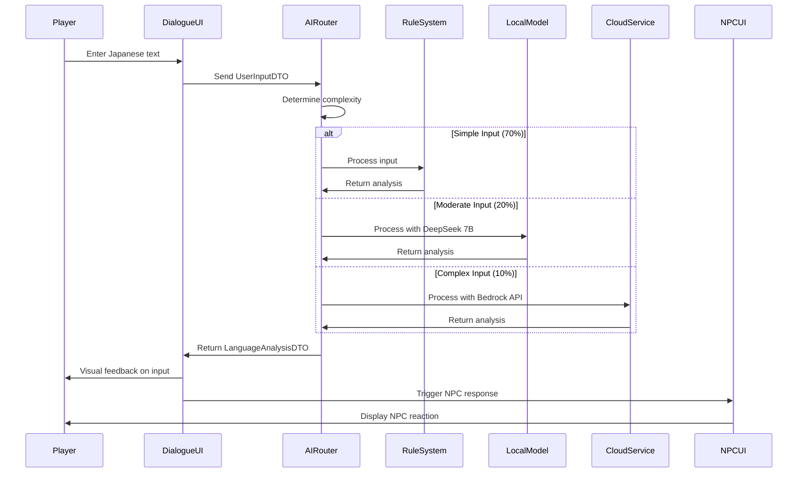
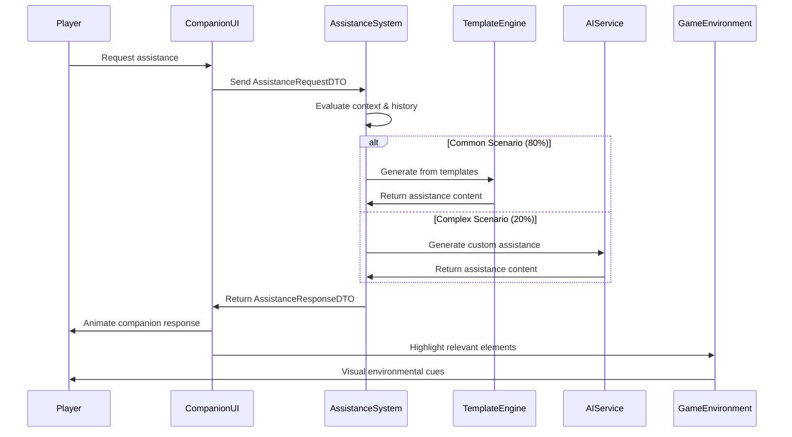
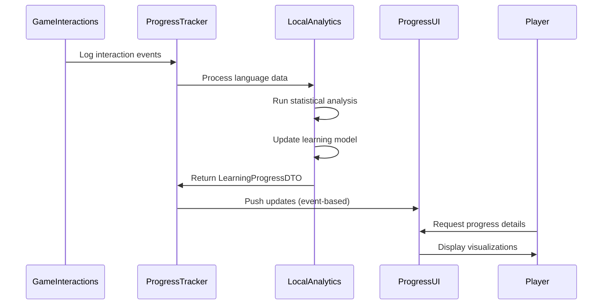
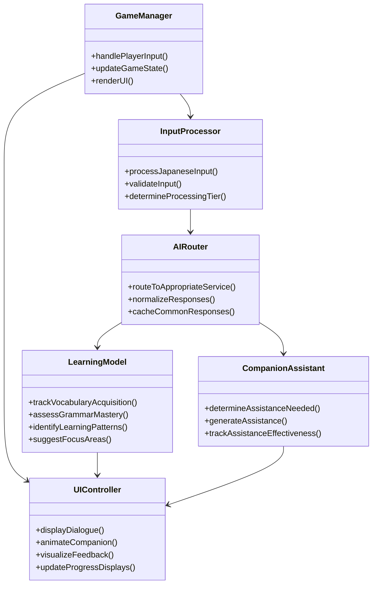

# Tokyo Train Station Adventure
## UI and AI Integration Specification

This document outlines how the user interface components integrate with the AI implementation in the Tokyo Train Station Adventure language learning game, focusing on the conceptual data flow and interaction patterns.

## UI-to-AI Communication Flow

### 1. Dialogue System to Language Processing AI

When a player interacts with an NPC through the dialogue system:

1. The UI captures the player's Japanese input (typed, selected, or drawn)
2. This input is passed to the AI's Language Processing System
3. The AI analyzes the input against expected responses using the tiered approach:
   - Tier 1: Rule-based systems handle common phrases (70% of interactions)
   - Tier 2: Local models process moderately complex inputs (20% of interactions)
   - Tier 3: Cloud-based Bedrock services handle novel or complex interactions (10% of interactions)
4. The AI returns a structured response containing:
   - Correctness assessment
   - Error identification
   - Suggested corrections
   - Context-appropriate NPC response
5. The UI then visualizes this feedback appropriately

This creates a closed loop where the UI handles presentation and input capture, while the AI system handles the linguistic intelligence.



### 2. Companion Assistance Interface to Companion AI

When a player requests help from their dog companion:

1. The UI displays the assistance options contextually relevant to the current situation
2. Player selection is sent to the Companion AI system
3. The AI determines appropriate assistance based on:
   - Current game context
   - Player's demonstrated language proficiency
   - Historical help patterns
   - Learning progression metrics
4. The AI generates appropriate hint content using:
   - Template-based responses for common scenarios
   - AI-augmented responses for complex situations
5. The UI visualizes the companion's response through:
   - Visual animations showing the dog's attention
   - Appropriate speech/thought bubbles
   - Highlighting of relevant environmental elements

The companion essentially becomes the embodied interface to the AI assistance system.



### 3. Learning Progress UI to Progress Tracking System

The Learning Progress UI would:

1. Subscribe to events from the AI's Progress Tracking System
2. Receive regular updates about:
   - Vocabulary acquisition metrics
   - Grammar point mastery
   - Conversation success patterns
   - Identified learning challenges
3. Transform these data points into intuitive visualizations
4. Provide interactive exploration of learning data

The local statistical analysis systems would feed data to these visualizations without requiring constant AI API calls.



## Implementation Strategy

To implement this integration effectively:

### 1. Define Clear Domain Events

Create a well-defined set of events that flow between UI and AI systems:
- `PlayerInputSubmitted`: Player provided Japanese input
- `InputAnalysisCompleted`: AI finished analyzing input
- `AssistanceRequested`: Player asked for companion help
- `AssistanceGenerated`: AI created help content
- `LearningMomentIdentified`: AI detected significant learning opportunity
- `VocabularyAcquired`: Player successfully used new vocabulary
- `GrammarPatternMastered`: Player demonstrated grammar understanding
- `ErrorPatternDetected`: AI identified recurring mistake type

### 2. Create Data Transfer Objects (DTOs)

Design structured data formats that travel between systems:

**UserInputDTO**
```json
{
  "inputText": "小田原までの切符をください",
  "inputType": "keyboard",
  "contextId": "ticket_machine_interaction",
  "timestamp": "2025-03-10T14:23:45Z",
  "previousExchanges": [],
  "playerLevel": {
    "overallJlptLevel": "N5",
    "particleAccuracy": 0.76,
    "vocabularySize": 382
  }
}
```

**LanguageAnalysisDTO**
```json
{
  "inputText": "小田原までの切符をください",
  "correctnessScore": 0.92,
  "errors": [
    {
      "errorType": "particle",
      "position": 4,
      "incorrect": "の",
      "correct": "の",
      "severity": "minor"
    }
  ],
  "suggestedResponse": "はい、小田原までの切符ですね。片道ですか、往復ですか？",
  "learningMoments": ["ticket_purchasing_vocabulary"],
  "processingTier": "rule_based"
}
```

**AssistanceRequestDTO**
```json
{
  "assistanceType": "vocabulary_help",
  "contextId": "ticket_machine_interaction",
  "focusWord": "切符",
  "timestamp": "2025-03-10T14:24:10Z",
  "playerHistory": {
    "previouslyRequested": ["までの", "ください"],
    "successfulUses": []
  }
}
```

**LearningProgressDTO**
```json
{
  "vocabularyStats": {
    "totalEncountered": 86,
    "activeMastery": 42,
    "passiveRecognition": 31,
    "needsReview": 13
  },
  "grammarStats": {
    "particleAccuracy": 0.78,
    "verbConjugation": 0.65,
    "sentenceFormation": 0.71
  },
  "interactionSuccessRate": 0.82,
  "recentAchievements": ["first_ticket_purchase"],
  "suggestedFocus": ["particle_use", "request_formations"]
}
```

### 3. Establish a Tiered Processing Pipeline

Following the AI Implementation Plan's tiered approach:

1. UI sends requests to a unified API endpoint
2. Request router determines appropriate processing tier:
   - Direct to local rules for common patterns (70% of interactions)
   - Send to local models for moderate complexity (20% of interactions)
   - Forward to cloud services for complex analysis (10% of interactions)
3. Responses are normalized to a consistent format regardless of processing tier
4. UI receives standardized responses it can reliably render

### 4. Implement Caching and Optimization

To maintain the cost-effective strategy:
- Cache common AI responses at the UI level
- Implement progressive loading for AI-dependent UI elements
- Use placeholder visualizations while waiting for AI processing
- Design fallbacks for offline or service interruption scenarios
- Store frequently used companion assistance patterns locally

### 5. Create an Abstraction Layer

Build a service interface layer that:
- Hides implementation details of the AI systems from the UI
- Allows swapping between local DeepSeek and cloud services
- Provides consistent response formats regardless of backend
- Handles error cases gracefully
- Logs interaction data for future model improvement

## Real-World Integration Example: The Ticket Machine Interaction

Here's how the complete flow would work for a ticket machine interaction:

1. **Game State**: Player approaches the ticket machine in the station
2. **UI Action**: Dialogue UI activates with the ticket machine interface
3. **Player Action**: Player attempts to type "小田原までの切符をください" (Ticket to Odawara please)
4. **UI Processing**:
   - Captures input text and surrounding game context
   - Packages into a `UserInputDTO`
   - Sends to the AI processing pipeline
5. **AI Processing** (tiered approach):
   - Local MeCab tokenizer processes the basic Japanese
   - Rule-based system recognizes this as a common phrase
   - Local validation checks for JLPT N5 grammar correctness
   - Determines the input is mostly correct but has a small particle error
6. **AI Response**:
   - Generates a `LanguageAnalysisDTO` with correctness score (90%)
   - Identifies the specific particle error
   - Suggests the correct form
   - Includes ticket machine's response logic
7. **UI Visualization**:
   - Highlights the particle error subtly
   - Shows the ticket machine processing the request
   - Displays ticket options for Odawara
   - Companion dog animation shows slight attention to the error
8. **Learning Model Update**:
   - Progress tracking system logs this interaction
   - Updates the player's particle usage statistics
   - Adds this vocabulary to encountered words
   - Determines if this is a learning moment worth highlighting
9. **UI Reflection**:
   - Learning progress UI subtly updates
   - New vocabulary potentially added to collection
   - Achievement progress potentially updated

This entire flow happens seamlessly, with the player experiencing it as a natural interaction with immediate feedback, while behind the scenes the tiered AI approach optimizes for both quality and cost.

## Domain Model Integration

The integration between UI and AI systems follows domain-driven design principles:



## Technical Architecture Considerations

The integration between UI and AI components should consider:

### 1. Latency Management
- Implement optimistic UI updates for likely responses
- Add loading states that don't interrupt gameplay
- Pre-fetch likely AI responses based on game context
- Design graceful fallbacks for high-latency situations

### 2. Error Handling
- Create contextual error recoveries for AI service failures
- Implement fallback dialogue paths when AI processing fails
- Design UI feedback that maintains immersion during errors
- Log errors for later analysis and improvement

### 3. Adaptive Loading
- Implement progressive enhancement based on available AI services
- Scale complexity of interactions based on processing capabilities
- Design content that degrades gracefully on less powerful devices
- Prioritize critical AI features over enhancement features

### 4. Testing Strategy
- Create simulation harnesses for AI service responses
- Implement A/B testing for different feedback visualization approaches
- Design user testing protocols specifically for AI-driven interactions
- Develop metrics for measuring AI responsiveness and effectiveness
