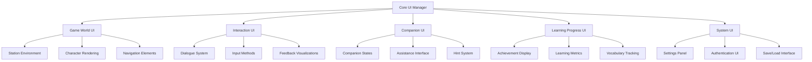

# Tokyo Train Station Adventure
## User Interface Components Specification

This document outlines the user interface components required for the Tokyo Train Station Adventure language learning game, focusing on both the game's frontend interfaces and how they interact with the backend logic.

## UI Architecture Overview

The Tokyo Train Station Adventure employs a layered UI architecture that separates presentation concerns from game logic while maintaining coherent domain modeling patterns. The UI components will follow a consistent pixel art aesthetic while providing intuitive interfaces for language learning interactions.

## 1. Game World UI Components

The visual representation of the game environment, characters, and interactive elements.

### 1.1. Station Environment Rendering

**Purpose:** To display the Tokyo train station environment in pixel art style

**Key Components:**
- **Main Concourse Layer**: Primary station area displaying information boards, ticket counters
- **Platform Layer**: Multiple train platforms with appropriate signage
- **Transition Areas**: Escalators, stairs, and walkways connecting different station areas
- **Interactive Object Indicators**: Visual highlights for objects players can interact with
- **Japanese Signage System**: Authentic station signs in Japanese with varying visibility based on player progress

**Technical Requirements:**
- Phaser.js sprite management for layered rendering
- Tile-based background system for efficient memory usage
- Dynamic sign generation based on game state
- Lighting effects for atmosphere and player guidance
- Camera system for following player movement

**Domain Considerations:**
- Signs should accurately represent real Tokyo station linguistic conventions
- Environment should reinforce the learning context while maintaining game playability
- Interactive elements should maintain consistent visual language across the game

### 1.2. Character Rendering System

**Purpose:** To display and animate the player, companion dog, and NPCs

**Key Components:**
- **Player Avatar System**: Pixel art character with multiple animation states
- **Companion Animation Set**: Dog character with expressive animations reflecting assistance states
- **NPC Rendering Engine**: Station staff and other characters with role-appropriate appearances
- **Expression System**: Facial expressions and body language to convey understanding/confusion
- **Positional Overlay System**: Speech bubbles and interaction indicators

**Technical Requirements:**
- Sprite sheet animation management
- Dynamic composition for character states
- Smooth transition between animation states
- Emotion indicator system tied to language understanding metrics

**Domain Considerations:**
- Animation states should subtly reinforce language learning success/failure
- Character expressions should provide intuitive feedback on communication effectiveness
- NPC appearances should authentically represent Tokyo station staff roles

### 1.3. Navigation Elements

**Purpose:** To help players navigate the station environment effectively

**Key Components:**
- **Mini-map Component**: Optional simplified station layout display
- **Directional Indicators**: Subtle visual cues for current objectives
- **Area Naming System**: Zone identifiers in both Japanese and English
- **Path History Visualization**: Optional breadcrumb trail showing previous movement
- **Companion Navigation Hints**: Visual indicators when dog has navigation advice

**Technical Requirements:**
- Dynamic generation of mini-map from game state
- Alpha fade system for non-intrusive directional cues
- Layered rendering for maintaining aesthetic consistency

**Domain Considerations:**
- Navigation elements should promote learning Japanese station terminology
- Bilingual labeling should follow station conventions (Japanese primary, English secondary)
- System should accommodate players with different spatial navigation skills

## 2. Interaction UI Components

Interface elements that enable player interaction with the game world and language learning mechanics.

### 2.1. Dialogue System UI

**Purpose:** To facilitate conversations between player and Japanese-speaking NPCs

**Key Components:**
- **Dialogue Box**: Customizable text display area with Japanese and optional hints
- **Character Portrait Frame**: Visual indicator of current speaking character
- **Text Animation System**: Character-by-character text reveal with appropriate timing
- **Dialogue History Scroller**: Access to previous exchanges in current conversation
- **Pronunciation Audio Interface**: Optional audio playback for dialogue text
- **Translation Peek System**: Gradual hint reveal controlled by player

**Technical Requirements:**
- Unicode support for proper Japanese character rendering
- Text wrapping and formatting for Japanese language conventions
- Smooth text animation with appropriate pacing
- Audio synchronization with text display

**Domain Considerations:**
- Dialogue UI should support learning without becoming a crutch
- System should accommodate varying levels of reading proficiency
- Interface should use conventions familiar to language learners

### 2.2. Input Methods Interface

**Purpose:** To provide multiple ways for players to respond in Japanese

**Key Components:**
- **Japanese Keyboard Interface**: Input method for typing Japanese responses
- **Kana Selection Panel**: Hiragana/Katakana character picker for beginners
- **Multiple Choice Response System**: Contextual response options of varying difficulty
- **Handwriting Recognition Interface**: Optional drawing input for character practice
- **Mixed Input System**: Combination of selection and typing for scaffolded learning
- **Voice Input Option**: Future expansion capability for speaking practice

**Technical Requirements:**
- IME (Input Method Editor) integration for Japanese text entry
- Touch/mouse optimized kana selection panel
- Response validation visualization tied to backend processing
- Adaptive difficulty adjustment based on player performance history

**Domain Considerations:**
- Input methods should match player skill level
- Progressive complexity to encourage growth without frustration
- Balance between genuine production and recognition-based activities

### 2.3. Feedback Visualization System

**Purpose:** To provide immediate, intuitive feedback on language use accuracy

**Key Components:**
- **Correctness Indicator**: Visual system showing degree of response accuracy
- **Error Highlighting**: Subtle indication of specific mistake locations
- **Success Animation**: Rewarding visual effects for correct responses
- **Progression Indicator**: Visual representation of advancing conversation
- **Learning Moment Capture**: System to highlight and save new language points
- **Correction Visualization**: Non-disruptive way to show proper formulations

**Technical Requirements:**
- Color-coding system for different types of errors/correctness
- Particle effect system for success reinforcement
- Timeline visualization for conversation progress
- Screenshot functionality for learning moment capture

**Domain Considerations:**
- Feedback should encourage without over-emphasizing mistakes
- System should distinguish between critical and minor errors
- Visual language should remain consistent with game aesthetic
- Feedback timing should support learning psychology principles

## 3. Companion UI Components

Interface elements specific to the dog companion's assistance functionality.

### 3.1. Companion State Visualization

**Purpose:** To display the companion's current mode and availability for assistance

**Key Components:**
- **Companion Mood Indicator**: Visual representation of dog's current state
- **Assistance Availability Meter**: Indicator showing when help can be requested
- **Attention Focus Visualization**: Effect showing what the dog is currently noticing
- **Relationship Meter**: Subtle indication of companion rapport based on interaction
- **State Transition Animations**: Smooth visual transitions between companion modes

**Technical Requirements:**
- State machine visualization tied to companion AI system
- Particle effects for attention indicators
- Animation sequencing for state transitions
- Icon system for different assistance capabilities

**Domain Considerations:**
- Companion states should indirectly reinforce learning strategies
- Visual language should be intuitive without explicit instructions
- States should encourage appropriate help-seeking behavior

### 3.2. Assistance Interface

**Purpose:** To allow players to request and receive help from the companion

**Key Components:**
- **Help Request Button**: "Dog whistle" icon to activate assistance
- **Assistance Type Selector**: Menu for different types of help
- **Hint Level Control**: Player control over hint directness
- **Contextual Suggestion Display**: Relevant assistance based on current situation
- **Vocabulary Lookup Tool**: Quick access dictionary for current scenario vocabulary
- **Grammar Pattern Reminder**: Visual representation of relevant patterns

**Technical Requirements:**
- Context-aware menu generation based on current game state
- Radial menu system for quick assistance selection
- Integration with learning model to provide appropriate help level
- Adaptive suggestions based on player history

**Domain Considerations:**
- Interface should encourage strategic help usage rather than dependence
- System should model effective language learning strategies
- Assistance should maintain immersion in the game world

### 3.3. Hint System Visualization

**Purpose:** To provide escalating levels of assistance while maintaining challenge

**Key Components:**
- **Progressive Hint Display**: System showing increasingly specific clues
- **Visual Hint Indicators**: Environmental highlights without explicit text
- **Demonstration Mode**: Companion showing example responses
- **Contextual Clue Bubbles**: Thought bubbles with subtle hints
- **Pattern Highlighting**: Visual emphasis on grammar patterns or vocabulary
- **Success Path Visualization**: Optional guidance showing next steps

**Technical Requirements:**
- Hint tree navigation system
- Alpha transparency system for visual indicators
- Highlight effect rendering for pattern emphasis
- Animation sequencing for demonstrations

**Domain Considerations:**
- Hint system should scaffold learning appropriately
- Visual hierarchy should guide attention without overwhelming
- System should adapt to player's demonstrated language proficiency

## 4. Learning Progress UI Components

Interface elements that track and display the player's language learning progress.

### 4.1. Achievement Display System

**Purpose:** To visualize player accomplishments and encourage progress

**Key Components:**
- **Badge Collection Interface**: Visual collection of earned achievements
- **Progress Milestone Markers**: Indicators of major game advancement points
- **Challenge Completion Tracker**: Record of optional language challenges
- **Accomplishment Notification**: Non-intrusive alerts for new achievements
- **Achievement Detail View**: Expanded information on earned accomplishments
- **Social Sharing Option**: Capability to share achievements (future expansion)

**Technical Requirements:**
- Badge rendering with unlock state visualization
- Toast notification system for new achievements
- Detail panel with achievement metadata
- Animation effects for achievement unlocking

**Domain Considerations:**
- Achievements should be meaningful from language learning perspective
- System should celebrate communication successes rather than just game mechanics
- Visual design should motivate continued engagement

### 4.2. Learning Metrics Dashboard

**Purpose:** To provide insight into language skill development

**Key Components:**
- **JLPT N5 Coverage Map**: Visual representation of vocabulary/grammar coverage
- **Skill Pentagon**: Five-axis visualization of different language skill areas
- **Conversation Success Rate**: Metrics on successful communication attempts
- **Vocabulary Acquisition Tracker**: Growing visualization of learned words
- **Time-based Progress Graph**: Historical view of learning over time
- **Weak Point Identifier**: Highlighting of areas needing additional practice

**Technical Requirements:**
- Data visualization components integrated with learning model
- Interactive elements for exploring specific metrics
- Real-time updates based on gameplay activities
- Chart rendering optimized for game environment

**Domain Considerations:**
- Metrics should accurately reflect actual language acquisition
- Visualization should encourage balanced skill development
- System should avoid discouraging representations for beginners

### 4.3. Vocabulary Tracking Interface

**Purpose:** To manage and reinforce vocabulary acquisition

**Key Components:**
- **Word Collection System**: Visual library of encountered vocabulary
- **Usage Frequency Indicator**: Visualization of word mastery through use
- **Contextual Example Bank**: Access to scenarios where words were encountered
- **Personal Vocabulary List**: Custom collections for focused study
- **Review Recommendation Engine**: Suggestions for vocabulary practice
- **Categorization Visualization**: Words grouped by theme or language function

**Technical Requirements:**
- Searchable vocabulary database interface
- Filtering and sorting capabilities
- Context screenshot retrieval system
- Integration with spaced repetition algorithms for review

**Domain Considerations:**
- Interface should connect vocabulary to practical usage contexts
- System should prioritize station-relevant terminology
- Design should support effective vocabulary acquisition strategies

## 5. System UI Components

Interface elements related to game system functions and settings.

### 5.1. Settings Panel

**Purpose:** To allow customization of game experience and learning parameters

**Key Components:**
- **Language Assistance Settings**: Controls for hint frequency and type
- **Audio Configuration**: Volume and voice settings
- **Text Display Options**: Font size, speed, and display duration
- **Difficulty Calibration**: Adjustment for challenge level
- **Accessibility Features**: Options for various accessibility needs
- **Learning Style Preferences**: Settings to match player's learning approach

**Technical Requirements:**
- Settings persistence across game sessions
- Real-time application of setting changes
- Intuitive controls for adjustments
- Default presets for common configurations

**Domain Considerations:**
- Settings should accommodate different learning preferences
- Options should maintain educational integrity while allowing personalization
- Interface should be accessible to language learners of varying proficiency

### 5.2. Authentication UI

**Purpose:** To manage player identity and data synchronization

**Key Components:**
- **Login Interface**: Clean, minimalist authentication form
- **Account Creation Flow**: Simple onboarding process
- **Profile Management**: Basic identity and preference settings
- **Data Sync Visualization**: Indication of synchronization status
- **Privacy Controls**: Settings for data collection and usage
- **Account Linking Options**: Connections to Google/Facebook (per design doc)

**Technical Requirements:**
- Secure authentication implementation
- Status indicators for connection state
- Error handling with clear messaging
- Compliance with data protection standards

**Domain Considerations:**
- Authentication should be frictionless for language learners
- System should respect cultural preferences regarding privacy
- Design should inspire trust and security

### 5.3. Save/Load Interface

**Purpose:** To manage game state persistence and progress continuation

**Key Components:**
- **Save Slot System**: Visual representation of save states
- **Auto-save Indicator**: Notification of automatic progress saving
- **Save Details Display**: Information about save contents and timestamp
- **Cloud Sync Status**: Indication of online synchronization status
- **Import/Export Functionality**: Options for transferring save data
- **Checkpoint Visualization**: Map of major progress points

**Technical Requirements:**
- Thumbnail generation for save states
- Metadata display for save selection
- Confirmation dialogs for overwriting
- Error recovery for sync failures

**Domain Considerations:**
- Save system should accommodate varying play session lengths
- Interface should be understandable across language barriers
- Design should encourage regular engagement through progress visualization

## Cross-Cutting UI Considerations

### Aesthetic Consistency

- 8-bit Famicom-style pixel art throughout all interfaces
- Consistent color palette with meaning-based variations
- Character design language that maintains coherence across contexts
- Animation principles applied consistently across all moving elements

### Accessibility Features

- Configurable text size and contrast
- Alternative input methods for different physical capabilities
- Color blindness consideration in feedback systems
- Audio cues to complement visual indicators
- Adjustable game speed for processing time

### Cultural Authenticity

- Accurate representation of Japanese railway signage
- Appropriate use of Japanese language patterns and station terminology
- Culturally appropriate interaction patterns with station staff
- Authentic companion behaviors that reflect Japanese expectations

### Learning Psychology Integration

- UI patterns that reinforce effective language acquisition methods
- Feedback timing that optimizes for memory formation
- Progress visualization that motivates continued engagement
- Assistance mechanisms that promote learning independence
- Error handling that reduces anxiety and encourages experimentation

## Implementation Approach

Given your preference for domain modeling and working backwards from goals, consider this implementation strategy:

1. **Define the Language Learning Interaction Model**:
   - Create domain models for each interaction type
   - Define success/failure states for language understanding
   - Map feedback patterns to cognitive learning principles

2. **Create UI Component Prototypes**:
   - Develop paper prototypes for key interaction flows
   - Build simple digital mock-ups of core components
   - Test with language learners before full implementation

3. **Implement Tiered Development**:
   - Start with essential dialogue and feedback systems
   - Add companion interface as second priority
   - Implement progress tracking as third phase
   - Develop system interfaces as needed throughout

4. **Integration with Game Logic**:
   - Define clear interfaces between UI and domain logic
   - Establish event patterns for UI state updates
   - Create abstraction layers for AI service interactions
